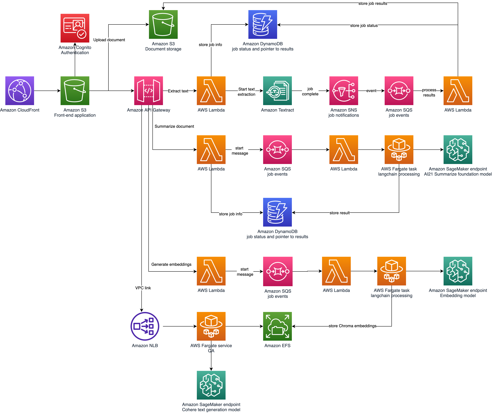

# Summarization and question answering for financial documents

This example shows you how to perform summarization and question answering for lengthy financial documents like annual reports to shareholders. 

For summarization, we split the document into smaller segments (five-pages by default) and summarize each segment. We use AI21's summarization model, which can handle input sequences up to about 10,000 words.

For question answering we use a technique called retrieval augmented generation, where we provide new information (the contents of the financial document) to a large language model.

## Attribution

Parts of the CDK code are adopted from [this repository](https://github.com/aws-samples/amazon-textract-serverless-large-scale-document-processing).

Parts of this solution are inspired by:

* https://medium.com/@shankar.arunp/augmenting-large-language-models-with-verified-information-sources-leveraging-aws-sagemaker-and-f6be17fb10a8
* https://github.com/arunprsh/knowledge-augmented-LLMs


## Architecture

The solution starts with a React Javascript application hosted in an S3 bucket fronted by CloudFront. 



When users upload a PDF to S3, they can then start a Textract job to extract text information. When that job completes, the user can then start a summarization job.

The front-end application calls methods on an API Gateway, which invokes Lambda functions for processing. The Lambda functions use SQS queues for asynchronous handling. The summarization job delegates to an ECS Fargate task as it may take several minutes to run. Job state is captured in DynamoDB tables.

## Clone repository

Clone this GitHub repository into a working directory.

## Deploy SageMaker endpoints

You must have access to SageMaker Jumpstart Foundation Models in this step.

We will use the AI21 Summarize model available through [SageMaker Jumpstart Foundation Models](https://aws.amazon.com/sagemaker/jumpstart/?sagemaker-data-wrangler-whats-new.sort-by=item.additionalFields.postDateTime&sagemaker-data-wrangler-whats-new.sort-order=desc). To begin, deploy the AI21 Summarize model in SageMaker Jumpstart. You will need to subscribe to the model and then follow the example notebook to deploy a SageMaker inference endpoint. See this [previous blog](https://medium.com/@shankar.arunp/augmenting-large-language-models-with-verified-information-sources-leveraging-aws-sagemaker-and-f6be17fb10a8) for more detailed instructions.

Once you have deployed the endpoint, create a file called `cdk/cdk.context.json` and add the endpoint names here. For example, if you deployed the AI21 summarization endpoint with the name `summarize`, the contents of `cdk.context.json` would be:

    {
        "sumEndpoint": "summarize"
    }

Next, follow this [notebook](https://github.com/arunprsh/knowledge-augmented-LLMs/blob/main/01-deploy-text-embedding-model.ipynb) to deploy a text embedding model. Add the endpoint name to `cdk.context.json` as `embedEndpoint`.

Finally, deploy a Cohere Medium model from SageMaker Jumpstart Foundation models.  Add the endpoint name to `cdk.context.json` as `qaEndpoint`.

_Note_: if you alter the endpoint names after deployment, you may need to recycle the containers in ECS to retrieve the latest values.

## CDK

The application relies on a CDK stack for required infrastructure. 

First, see the [CDK getting started guide](https://docs.aws.amazon.com/cdk/v2/guide/getting_started.html) to deploy and configure the CDK on your workstation.

Then go into the `cdk` directory and install required packages.

    npm i @aws-cdk/aws-cognito-identitypool-alpha
    npm i cdk-nag

Next, set the region on line 10 of `bin/cdk.ts`. Normally we would not hard-code the region, but it's a [necessary step](https://docs.aws.amazon.com/cdk/api/v2/docs/aws-cdk-lib.aws_elasticloadbalancingv2.NetworkLoadBalancer.html#logwbraccesswbrlogsbucket-prefix) to enable ELB access logging.

If you are running on ARM CPU Architecture, comment out the 3 sections in the lib/cdk/cdk-stack.ts file that look like the snippet below.  If you aren't sure what architecture you are running on, you can run the following commands on either platform:
1. Unix
```uname -m```
2. Windows 
```wmic OS get OSArchitecture```

```
      // Uncomment this section if running on ARM
      // runtimePlatform: {
      //   cpuArchitecture: ecs.CpuArchitecture.ARM64,
      // }
```

Now deploy the stack:

    cdk synth
    cdk deploy

## Create cognito user

Run this script to create a Cognito user.

    ./scripts/create-user.sh <user name> <user email> <password> <user pool id> <client id> <group name>

## Deploy front end

Finally, build and load the React app.  Adjust any necessary values in `frontend/src/config.js`.

    cd frontend
    npm install # only needed once
    yarn build
    aws s3 sync build/ s3://<app bucket>

Now you can access the applicaation at:

    https://`CdkStack.AppUrl`/index.html

## Security notes

### CloudFront certificate

For the purposes of this example, we use the CloudFront default viewer certificate. Distributions that use the default CloudFront viewer certificate have a security policy set to TLSv1 regardless of the specified 'MinimumProtocolVersion'. Vulnerabilities have been and continue to be discovered in the deprecated SSL and TLS protocols. For production deployments, we recommend specifying a viewer certificate that enforces a minimum of TLSv1.1 or TLSv1.2 in the security policy. 

## Security

See [CONTRIBUTING](CONTRIBUTING.md#security-issue-notifications) for more information.

## License

This library is licensed under the MIT-0 License. See the LICENSE file.

